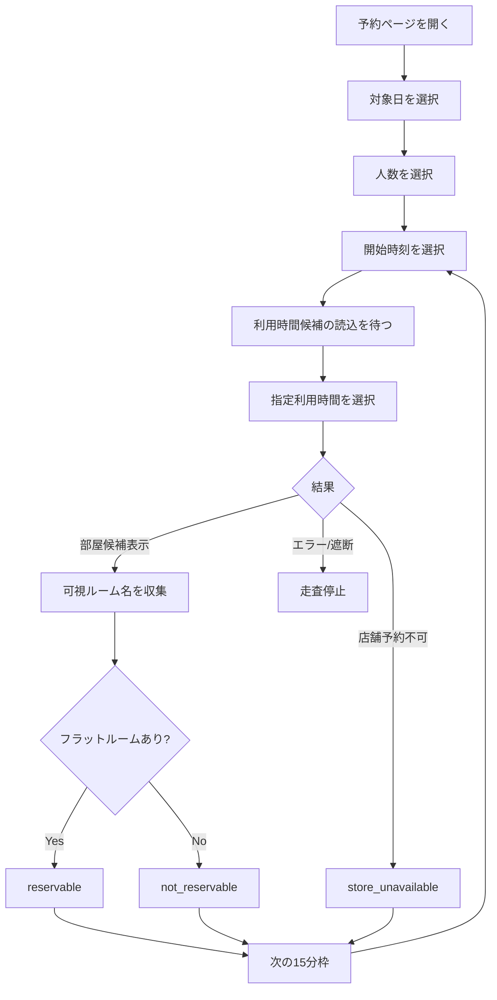
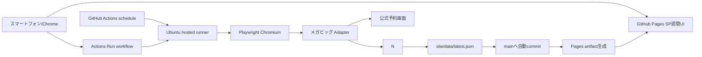
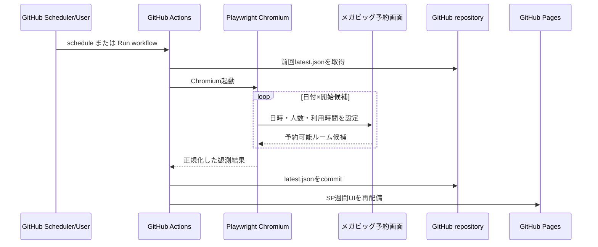

# 布施駅前 カラオケ特定ルーム空き確認ツール 要件・基本設計

作成日: 2026-07-19  
改訂: v3.1（GitHub Pages向けSP週間UIとActions接続を実装）  
対象タイムゾーン: Asia/Tokyo

## 1. 結論

本ツールは、公式の実予約画面へ日時・人数・利用時間を自動入力し、予約候補として表示されたルーム名を15分刻みで収集するGitHub上のオンラインツールとする。

ローカルMacは使用しない。GitHub ActionsのUbuntu runner上でPlaywright Chromiumを実行し、結果をGitHubへ保存する。閲覧方法は次の2方式を用意する。

| 閲覧方式 | 公開範囲 | UI | 採用条件 |
|---|---|---|---|
| GitHub Pages | 原則インターネット公開 | SP週間カード、最短枠、開始～終了時刻、鮮度表示 | 初期実装 |
| private repository内のMarkdown | リポジトリ参加者のみ | 7日分の表、実行状況、予約リンク | 非公開運用が必要な場合の将来代替 |

初期実装はGitHub PagesのSP週間UIを標準とする。個人アカウントではprivate repositoryから公開してもPagesサイト自体は原則公開される。完全に非公開のPagesはGitHub Enterprise Cloudのorganization構成が必要となる。

| 対象 | 自動判定方法 | 判定結果 |
|---|---|---|
| ジャンカラ 布施駅前2号店 008号室 | 008号室専用予約導線で、指定条件が予約可能か確認 | `008号室 Web予約可／不可` |
| メガビッグ 布施駅前店 フラットルーム | 実予約画面へ条件を設定し、予約可能な「お部屋の希望」に`フラットルーム`が含まれるか確認 | `フラットルーム Web予約可／不可` |

メガビッグでは、「フラットルーム」が予約候補に現れる時間を全候補時間について自動検索する。電話確認を主方式にはしない。

利用者はChrome等でGitHubを開くだけで週間表を確認できる。Macの起動、ローカルサーバー、Chrome拡張機能は不要とする。

## 2. 前回設計からの重要な修正

前回は、メガビッグ予約画面に「通常ルーム」と「加熱式たばこ専用ルーム」しか表示されなかったことから、Webではフラットルームを判定できないと解釈した。しかし実際には、表示される部屋一覧そのものが、入力条件でWeb予約可能な候補である。

### 2.1 実画面での再検証

2026-07-19に[メガビッグ布施駅前店の実予約画面](https://big-echo.tottokun.com/ownedmedia/ownedmedia_immediately_be/gXmZjh9iVXzm67v)を確認した。

| 条件 | 表示された予約可能ルーム候補 |
|---|---|
| 2026-07-19 13:00・2名・2時間 | 通常ルーム（禁煙）、加熱式たばこ専用ルーム |
| 2026-07-20 10:00・2名・2時間 | 最新機種、シングルプロジェクター、デュアルプロジェクター、通常ルーム（禁煙）、**フラットルーム**、加熱式たばこ専用ルーム |
| 2026-07-20 13:00・2名・2時間 | 最新機種、シングルプロジェクター、デュアルプロジェクター、通常ルーム（禁煙）、**フラットルーム**、加熱式たばこ専用ルーム |

この差から、指定条件の結果一覧に`フラットルーム`が含まれるかを読むことで、Web予約可否を判定できる。

### 2.2 「空き」の定義

ツールが判定するのは、店舗内で物理的に未使用かどうかではなく、次の状態である。

> 指定した日付・開始時刻・人数・利用時間で、対象ルームが公式Web予約画面の予約候補として提示されること。

画面上の表記は誤解を避けるため、原則として`空き`ではなく`Web予約可`、`Web予約不可`を使用する。

## 3. 対象と目的

### 3.1 対象ルーム

| ID | 店舗 | 対象 | 定員・条件 | 公式導線 |
|---|---|---|---|---|
| `jankara-fuse2-008` | ジャンカラ 布施駅前2号店 | 008号室 ファミリーマットルーム（Blu-ray／ミラーリング、JOYSOUND MAX） | 1～6名 | [店舗ページ](https://jankara.ne.jp/shop/124/) |
| `megabig-fuse-flat` | メガビッグ 布施駅前店 | フラットルーム | 予約画面が受け付ける人数 | [予約画面](https://big-echo.tottokun.com/ownedmedia/ownedmedia_immediately_be/gXmZjh9iVXzm67v) |

### 3.2 目的

- 利用者が時間を一つずつ変更して確認する作業をなくす。
- 指定日の指定時間帯を15分刻みで自動走査する。
- 何時開始なら希望ルームをWeb予約できるかを一覧表示する。
- 予約不可から予約可へ変化した場合に通知する。
- 実際の予約確定は公式ページで利用者が行う。

### 3.3 対象外

- 自動予約、予約確定、決済、キャンセル
- 氏名、電話番号、メールアドレス、カード情報の代理入力・保存
- CAPTCHA、アクセス制御、年齢確認等の回避
- プロキシローテーション、指紋偽装、ステルス化等の検知回避
- Web予約不可を「物理的に満室」と断定すること

## 4. 利用者要件

### 4.1 検索条件

| 項目 | 必須 | 仕様 |
|---|---:|---|
| 対象ルーム | 必須 | 1件または両方 |
| 人数 | 必須 | 初期対応1～6名。予約画面の上限内で拡張可 |
| 対象日 | 必須 | 標準は今日を含む向こう7日間。必要に応じて個別日へ絞り込み可 |
| 検索開始時刻 | 必須 | 例: 09:00 |
| 検索終了時刻 | 必須 | 例: 23:00 |
| 利用時間 | 必須 | 30分、1時間、1時間30分、2時間等 |
| 更新頻度 | 任意 | GitHub Actionsの定期実行。Actions利用時間上限を考慮して設定 |
| 通知 | 任意 | GitHub Issue／GitHub通知。Discord Webhookも追加可能 |

### 4.2 基本シナリオ

1. 利用者が「2名、2時間、今日から7日間」を登録する。
2. スクレイパーが今日、明日、2日後…6日後の順に処理する。
3. 各日について、予約画面が提示する開始時刻を09:00、09:15、09:30…のように順番に設定する。
4. 各開始時刻について、予約候補の部屋名を取得する。
5. `フラットルーム`または対象の008号室が含まれるかを判定する。
6. 結果を`site/data/latest.json`へ保存し、GitHubへ自動commitする。
7. 日付ごとに開始・終了時刻をまとめ、GitHub PagesのSP週間画面へ表示する。
8. 前回不可だった枠が予約可になった場合、通知する。
9. 利用者は通知または一覧から公式予約画面を開き、自分で予約する。

## 5. 機能要件

| ID | 要件 | 優先度 | 受入条件 |
|---|---|---:|---|
| FR-01 | 監視条件を登録・編集・停止できる | Must | GitHub上の`config/watch.json`で対象、人数、時間帯、利用時間を保存できる |
| FR-02 | 対象時間帯を15分刻みで自動走査する | Must | 設定範囲内の全開始候補を処理する |
| FR-03 | 予約候補の部屋名一覧を取得する | Must | 実画面に表示された可視候補を正規化して保存する |
| FR-04 | 対象ルーム名の有無でWeb予約可否を判定する | Must | `フラットルーム`の有無を正しく判定する |
| FR-05 | ジャンカラ008号室を部屋単位で判定する | Must | 他ルームの空きを008号室へ混入させない |
| FR-06 | 開始可能時間を表・タイムラインで表示する | Must | 日付×15分刻みの結果を一覧化する |
| FR-07 | 最終確認時刻と次回確認時刻を表示する | Must | すべての結果に鮮度を表示する |
| FR-08 | 予約可への状態変化を通知する | Must | `not_reservable → reservable`で通知する |
| FR-09 | 重複通知を抑止する | Must | 同一枠・同一状態で再通知しない |
| FR-10 | 取得失敗と予約不可を区別する | Must | 失敗時に`Web予約不可`と誤判定しない |
| FR-11 | 公式予約ページを開ける | Must | 対象店舗の予約導線へ1クリックで移動できる |
| FR-12 | 結果履歴を保存する | Should | 直近30日間の状態変化を閲覧できる |
| FR-13 | 手動の「今すぐ再確認」を提供する | Should | GitHub Actionsの`Run workflow`から走査を開始できる |
| FR-14 | レイアウト変更を検知する | Must | 必須要素が消えた場合はスクレイパーを停止する |
| FR-15 | 自動予約を行わない | Must | 個人情報入力画面以降へ進まない |
| FR-16 | GitHub上だけで運用できる | Must | ローカルPCを停止していても定期取得・保存・閲覧が継続する |
| FR-17 | 週間表を自動更新する | Must | 成功した走査後に`latest.json`をcommitし、Pagesを再配備する |
| FR-18 | Actions利用量を可視化する | Should | 実行時間と月間概算をダッシュボードに表示する |

## 6. 状態設計

### 6.1 内部状態

| 状態 | 意味 | 画面表示 |
|---|---|---|
| `reservable` | 対象ルームが予約候補に表示された | Web予約可 |
| `not_reservable` | 結果取得は成功したが対象ルームが候補にない | Web予約不可 |
| `store_unavailable` | 指定条件で店舗のお席自体を用意できない | 店舗Web予約不可 |
| `unknown` | 応答が曖昧で判定不能 | 判定不能 |
| `error` | 通信・画面操作・解析に失敗 | 確認失敗 |
| `blocked` | CAPTCHA、403、429等で自動処理停止 | 自動確認停止 |

### 6.2 メガビッグの判定表

| 実画面の状態 | 判定 |
|---|---|
| 「お部屋の希望」に`フラットルーム`が表示 | `reservable` |
| 「お部屋の希望」は正常表示されたが`フラットルーム`がない | `not_reservable` |
| 「ご希望の条件でお席がご用意できませんでした」等 | `store_unavailable` |
| 利用時間選択肢が取得できない | `unknown`または`error` |
| 部屋候補領域の仕様が変わった | `error`としてパーサー停止 |
| CAPTCHA、403、429 | `blocked`として全自動走査停止 |

対象語は完全一致を基本とし、前後空白・全角半角・末尾スラッシュのみ正規化する。`フラット`だけの曖昧な部分一致では判定しない。

### 6.3 ジャンカラの判定表

008号室専用導線を使用し、日付・開始時刻・人数・利用時間を設定した結果を読む。

| 実画面の状態 | 判定 |
|---|---|
| 008号室で予約申込みに進める | `reservable` |
| 指定条件で008号室の予約候補がない | `not_reservable` |
| 電話問い合わせのみ、または判定不能 | `unknown` |
| ページ仕様変更・通信失敗 | `error` |

## 7. メガビッグ自動走査アルゴリズム

### 7.1 画面操作フロー



### 7.2 擬似コード

```python
async def scan_megabig(rule):
    page = await open_reservation_page()

    for target_date in rule.dates:
        await select_date(page, target_date)
        await select_party_size(page, rule.party_size)

        for start_at in quarter_hour_slots(rule.time_from, rule.time_to):
            await select_start_time(page, start_at)
            await wait_until_course_options_loaded(page)
            await select_course_by_visible_label(page, rule.duration_label)
            result = await wait_for_room_result(page)

            if result.kind == "room_candidates":
                names = normalize_room_names(result.visible_names)
                state = (
                    "reservable"
                    if "フラットルーム" in names
                    else "not_reservable"
                )
            elif result.kind == "store_unavailable":
                names = []
                state = "store_unavailable"
            else:
                raise ParserError(result.reason)

            save_observation(target_date, start_at, names, state)
            await polite_interval()
```

### 7.3 セレクター方針

現時点の実画面では次の要素を確認できるが、実装ではIDだけへ依存しすぎない。

| 用途 | 現行の識別例 | 代替確認 |
|---|---|---|
| 開始時 | `#select_hours` | ラベル`時間`付近の最初のselect |
| 開始分 | `#select_minutes` | 開始時selectに隣接するselect |
| 人数 | `#selected_adult` | ラベル`人数` |
| 利用時間 | `#selected_course_id` | ラベル`ご利用時間` |
| 予約候補名 | `.course-name-strong` | `お部屋の希望`領域内の可視カード名 |

実装は、まず意味のあるラベル・見出しで領域を特定し、その領域内で候補を読む。セレクターが見つからない場合に推測で処理を続けず、`error`として停止する。

### 7.4 時間枠の扱い

- 時・分の選択肢は予約画面が返した値だけを使用する。
- 分は通常00、15、30、45だが、固定値と決めつけず画面の選択肢から生成する。
- 予約画面に存在しない時刻は走査対象外とする。
- 利用時間は数値IDではなく表示ラベル（例: `2時間`）で選ぶ。コースIDは日付や料金区分で変わり得る。
- 営業日をまたぐ深夜時間は、画面が示す予約日との対応を保持する。
- 取得結果は「開始時刻＋指定利用時間」の組として保存する。

## 8. 走査頻度・負荷制御

自動アクセスは行うが、回避的・攻撃的な実装にはしない。

### 8.1 推奨スケジュール

GitHub-hosted runnerの利用時間を抑えるため、30分ごとの全件走査は行わない。初期値は次の2ジョブとする。cronは毎時0分を避け、Asia/Tokyo基準で実行する。

| `scan-and-deploy.yml`の起動 | 対象 | 初期頻度 | 目的 |
|---|---|---:|---|
| near schedule | 今日・明日 | 4時間ごと | 直近の空き変化を追い、Pagesを更新 |
| week schedule | 今日～6日後 | 1日1回 | 週間表全体を走査し、Pagesを更新 |
| `workflow_dispatch` | 今日・明日または7日間 | 手動 | GitHubの`Run workflow`から即時確認する |

初回PoCで実測時間を記録し、月間Actions利用量が契約枠へ収まる場合だけ頻度を上げる。GitHub Freeのprivate repositoryは標準runnerが月2,000分、GitHub Proは月3,000分が含まれるため、全営業時間を30分ごとに走査する設計は対象外とする。

日付が変わった時点で前日を一覧から外し、新しい7日目を追加する。週間ウィンドウは常に「本日～6日後」を維持する。

### 8.2 制御ルール

- Providerごとの同時ブラウザ操作は1件に限定する。
- workflow間でも`concurrency.group: megabig-scan`を共有し、重複実行を直列化する。
- 15分枠を順番に処理し、並列走査しない。
- 各枠の処理間に2～5秒のランダム待機を置く。
- 同一条件の二重ジョブを統合する。
- 直近結果が十分新しい場合は再利用する。
- タブ・ブラウザを枠ごとに起動せず、1回の走査中は同じページを再利用する。
- 403、429、CAPTCHA、アクセス拒否、連続5回の画面解析失敗で停止する。
- User-Agent偽装、IP変更、プロキシ、CAPTCHA回避は行わない。
- scheduled workflowが遅延・欠落しても、次回実行時に期限切れ日付を優先する。

### 8.3 初回走査時間の目安

| 検索範囲 | 枠数 | 1枠平均3秒の場合 |
|---|---:|---:|
| 4時間 | 16 | 約48秒＋画面読込 |
| 8時間 | 32 | 約96秒＋画面読込 |
| 12時間 | 48 | 約144秒＋画面読込 |
| 7日間・1日12時間 | 336 | 約17分＋日付変更・画面読込 |
| 7日間・全営業時間 | 予約画面の候補数による | おおむね20～45分を想定 |

7日間は日付単位でキューに分割し、今日から順に処理する。初回走査の全完了を待たず、完了した日・時刻から画面へ順次表示する。

### 8.4 GitHub固有の制約

| 制約 | 設計上の対応 |
|---|---|
| scheduled workflowは混雑時に遅延・欠落し得る | 正確な定刻実行を保証せず、最終確認時刻と期限切れ表示を必須にする |
| public repositoryは60日間活動がないとscheduled workflowが自動停止し得る | private repositoryを初期推奨とし、停止を週次ヘルスチェックで検知する |
| GitHub-hosted runnerの送信元IPは固定ではない | IP許可リストには依存しない。予約サイトに拒否された場合は`blocked`で停止する |
| Actionsは本来ソフトウェア開発・テスト・配備向けである | 本ツールの定常監視基盤としての利用はGitHub追加規約上の運用リスクがある。PoC後も継続利用するかを利用者が判断する |
| GitHub Pagesは静的サイトである | 取得はActions、表示は静的JSON＋JavaScriptに分離する |
| Pages上へGitHub tokenを置けない | 「今すぐ確認」はActions画面へのリンクとし、ブラウザから直接API実行しない |

## 9. 画面設計

### 9.1 ダッシュボード

```text
┌────────────────────────────────────────────────────────────┐
│ メガビッグ布施駅前店 フラットルーム週間確認               │
│ 2名 / 2時間 / 10:00～24:00  [Actionsから今すぐ確認]       │
│ 最短の予約可能枠: 7/20（月）10:00開始                      │
├────────────────────────────────────────────────────────────┤
│ 7/19（日）  × Web予約可能な開始時刻なし       確認 13:05   │
│              [15分詳細を開く]                              │
├────────────────────────────────────────────────────────────┤
│ 7/20（月）  ● 10:00～12:00 / 10:15～12:15 ほか 確認 13:08│
│              [15分詳細を開く] [予約画面を開く]             │
├────────────────────────────────────────────────────────────┤
│ 7/21（火）  ● 09:00～11:00 / 09:15～11:15 ほか 確認 13:11│
│              [15分詳細を開く] [予約画面を開く]             │
├────────────────────────────────────────────────────────────┤
│ 7/22（水）  ◔ 走査中 32 / 80枠                            │
├────────────────────────────────────────────────────────────┤
│ 7/23（木）  … 確認待ち                                    │
│ 7/24（金）  … 確認待ち                                    │
│ 7/25（土）  … 確認待ち                                    │
└────────────────────────────────────────────────────────────┘
```

週間ビューは「日付カード」を縦に7枚並べ、各日には次を表示する。

- Web予約可能な開始時刻のまとまり
- 予約可能枠数
- 最終確認時刻と情報の鮮度
- 走査中の場合は完了枠数
- 15分詳細を開くボタン
- 予約可能な日だけ公式予約画面ボタン

日付カードを開くと、次の15分詳細を表示する。

```text
7/20（月）・2名・2時間利用
開始   判定             確認時刻
10:00  ● Web予約可      13:07
10:15  ● Web予約可      13:07
10:30  ● Web予約可      13:08
10:45  × Web予約不可    13:08
11:00  ? 判定不能       13:09
```

GitHub Pagesでは人数・利用時間・時間帯を画面上部に表示する。監視条件の変更は`config/watch.json`をGitHub上で編集し、`Run workflow`を押して反映する。

### 9.2 表示ルール

| 表示 | 意味 |
|---|---|
| 緑 `● Web予約可` | 対象ルーム名を予約候補で確認 |
| 黒 `× Web予約不可` | 正常な結果に対象ルーム名がない |
| 灰 `? 判定不能` | 読込未完了または曖昧な応答 |
| 赤 `! 確認失敗` | 通信・画面解析エラー |
| 橙 `■ 自動確認停止` | 403、429、CAPTCHA等 |

色だけに依存せず、文字とアイコンを併記する。

### 9.3 利用開始・終了時刻の表示

各予約可能枠は、走査した開始時刻へ指定利用時間を加算し、`開始～終了`で表示する。

例: 利用時間2時間で10:00、10:15、10:30開始が予約可能な場合は、次のように表示する。

```text
10:00～12:00
10:15～12:15
10:30～12:30
```

週間カードでは、候補が多い場合に次のように圧縮表示する。

```text
10:00～12:30の範囲で2時間枠を選択可
開始候補: 10:00 / 10:15 / 10:30
```

これは`10:00～12:30を連続して予約できる`という意味ではない。2時間の予約枠を、表示された開始候補から選べるという意味である。日付カードを開くと、すべての`開始～終了`を個別表示する。

### 9.4 SP表示とページ更新

| 項目 | 仕様 |
|---|---|
| 対応幅 | 320px以上を必須とし、スマートフォンでは1カラム表示 |
| 初期表示 | 店舗・ルーム、人数・利用時間、最短枠、今日から7日分を表示 |
| 日付カード | タップで展開し、その日の全`開始～終了`枠を個別表示 |
| ページ読込 | `latest.json`へcache-busting queryを付け、保存済みの最新結果を即時表示 |
| 自動反映 | ページを開いている間は60秒ごとに`latest.json`を再読込 |
| 鮮度 | `たった今／N分前／N時間前に取得`を常時表示。期限切れは警告色 |
| 手動走査 | `今すぐ確認を実行`からGitHub Actions画面を開き、完了後にページへ自動反映 |

GitHub Pagesは静的配信であり、ページの再読み込みそのものをトリガーに新しいPlaywright走査を同期実行することはできない。したがって「ページ更新した瞬間」の意味は、GitHub上に保存された最新走査結果をその場で読み直すこととする。新規走査はscheduled workflowまたは`Run workflow`で実行し、UIは取得時刻を明示して古い結果を最新と誤認させない。

## 10. システム構成



### 10.1 推奨技術

| レイヤー | 推奨技術 | 理由 |
|---|---|---|
| 定期実行 | GitHub Actions | Macを起動せずGitHub上で実行できる |
| 実行環境 | `ubuntu-latest` + Node.js 22 | GitHub-hosted runnerで再現可能 |
| ブラウザ自動化 | Playwright Chromium | 動的な実予約画面を操作でき、公式にCI実行手順がある |
| 状態保存 | main branchの`latest.json` | DBサーバー不要で前回結果を保持できる |
| SP UI | HTML/CSS/JavaScript + GitHub Pages | 320px以上で7日カードと個別枠を表示できる |
| 診断 | Actions artifact + スクリーンショット | 失敗時だけ7日間保持する |
| テスト | Node syntax check + 実画面smoke test | UIとセレクター変更を検知する |

### 10.2 リポジトリ構成

```text
.
├── .github/workflows/
│   ├── scan-and-deploy.yml    # 定期走査・JSON保存・Pages配備
│   └── deploy-pages.yml       # UIだけ変更した場合のPages配備
├── config/
│   └── watch.json             # 人数・利用時間・対象時間帯
├── src/
│   └── scan-megabig.mjs       # 実予約画面走査・結果マージ
├── site/
│   ├── index.html
│   ├── app.js
│   ├── config.js
│   ├── styles.css
│   └── data/latest.json
├── package.json
├── package-lock.json
└── README.md
```

### 10.3 workflow処理



走査jobには`contents: write`だけを与える。Pages配備jobは`contents: read`、`pages: write`、`id-token: write`へ分離する。外部PRから走査workflowを起動できない設定とし、予約ページのCookieやGitHub tokenを成果物・trace・ログへ出力しない。

### 10.4 Provider Adapter

初期実装ではメガビッグ専用の`scan-megabig.mjs`へ画面操作を閉じ込める。ジャンカラ追加時にProvider Adapterへ共通化する。

## 11. データ設計

### 11.1 `config/watch.json`

```json
{
  "timezone": "Asia/Tokyo",
  "partySize": 2,
  "durationMinutes": 120,
  "timeFrom": "10:00",
  "timeTo": "24:00",
  "daysAhead": 7,
  "delayMinMs": 2000,
  "delayMaxMs": 5000
}
```

### 11.2 `latest.json`

| フィールド | 型 | 内容 |
|---|---|---|
| `schema_version` | string | JSON形式の版 |
| `generated_at` | datetime | 更新時刻（JSTを併記） |
| `target` | object | 店舗、ルーム、人数、利用時間 |
| `scan` | object | workflow全体の状態、走査済み日、エラー |
| `days[]` | array | 今日から7日分の結果 |
| `days[].slots[]` | array | Web予約可だった開始、終了、状態、確認時刻 |
| `days[].scan_status` | string | success/partial/pending |
| `days[].state_counts` | object | reservable/not_reservable/error等の件数 |

通常時はページの全HTML、Cookie、個人情報を保存しない。画面解析エラー時だけスクリーンショットをActions artifactへ保存し、保持期間を7日とする。個人情報入力前の画面だけを対象とし、公開Pagesには含めない。

## 12. 通知設計（次フェーズ）

### 12.1 通知条件

- `not_reservable / store_unavailable / unknown → reservable`で通知する。
- 同じ枠が`reservable`のままなら再通知しない。
- 一度`not_reservable`へ戻った後、再び`reservable`になれば再通知する。
- 複数の連続枠が同時に空いた場合は1通へまとめる。
- `error`や`blocked`は予約通知と分けて運用通知する。
- 対象ルームごとにopen中の通知Issueは最大1件とし、新しい空きはコメント追記で集約する。
- 通知先はGitHub Notificationsとする。利用者がrepositoryを`Watch`するとWeb・メール・GitHub Mobileで受け取れる。

### 12.2 通知例

```text
メガビッグ布施駅前店 フラットルーム
Web予約可能な開始時刻が見つかりました。

日付: 2026-07-20
人数: 2名
利用時間: 2時間
開始可能: 10:00～10:30
確認時刻: 09:42 JST

[公式予約画面を開く]
```

Pagesから直接予約は実行しない。リンク先の公式画面で利用者が日時を再確認して予約を確定する。

## 13. 非機能要件

| ID | 分類 | 要件 |
|---|---|---|
| NFR-01 | 正確性 | 対象ルーム名を確認できた場合だけ`reservable`とする |
| NFR-02 | 誤判定防止 | 解析失敗を`not_reservable`へ変換しない |
| NFR-03 | 鮮度 | 最終確認時刻、走査進捗、次回確認時刻を表示する |
| NFR-04 | 負荷 | 単一逐次走査、間隔、時間当たり上限を守る |
| NFR-05 | 停止性 | 403、429、CAPTCHA、仕様変更で自動停止する |
| NFR-06 | セキュリティ | workflow権限をjob単位で最小化し、tokenやCookieをPagesへ含めない |
| NFR-07 | プライバシー | 氏名、電話番号、メール、カード、CookieをGitHubへ保存しない |
| NFR-08 | 可用性 | 前回JSONから未確認・期限切れ枠を再構築し、scheduled workflowの遅延を表示する |
| NFR-09 | 保守性 | Provider Adapterとparser_versionで画面変更へ対応する |
| NFR-10 | 時刻 | Asia/Tokyoで保存・表示し、深夜の日付境界を明示する |
| NFR-11 | 操作性 | 1画面でメガビッグの7日分の開始～終了時刻を確認できる |
| NFR-12 | アクセシビリティ | 色だけで状態を表現しない |
| NFR-13 | オンライン完結 | ローカルPC、常駐サーバー、Chrome拡張機能へ依存しない |
| NFR-14 | コスト | Actions実行時間を記録し、月間契約枠の80%で頻度見直し警告を出す |
| NFR-15 | 公開制御 | Pages有効化前に、結果がインターネット公開されることを明示する |

## 14. エラー処理

| ケース | 処理 |
|---|---|
| ページ読込タイムアウト | 1回だけ再読込後、`error`。次の定期走査まで待つ |
| 日付・時刻候補が存在しない | その枠を対象外として理由を保存 |
| 指定利用時間が選択肢にない | `unknown`。別の時間へ自動変更しない |
| 部屋候補が正常表示され対象名なし | `not_reservable` |
| 必須見出し・select・候補領域が消えた | 仕様変更として全走査停止 |
| CAPTCHA | 解かずに`blocked`として停止 |
| HTTP 403/429 | `blocked`として停止し、利用者へ通知 |
| 予約画面が電話案内のみ | `unknown`または`store_unavailable`として保存 |
| ブラウザ異常終了 | ジョブを`partial`にし、次回workflowで未確認枠だけ再処理 |

## 15. 利用規約・GitHub運用上のリスク

第一興商の[利用規約](https://www.dkkaraoke.co.jp/use/)には、BOT、クローラー、スクレイピング等による自動アクセスを禁止する記載がある。ジャンカラの[禁止事項](https://jankara.me/misc/kiyakuDetail011)にも、同社・関連会社の情報収集やサービス運営を阻害する行為が含まれる。

本設計は利用者の明示的な指示に基づき自動スクレイピング方式を採用するが、次を前提とする。

- private repositoryでの個人利用を初期値とする。
- 結果を販売、公開、再配布しない。GitHub Pagesは初期状態で無効にする。
- 低頻度・逐次アクセスとする。
- 制限・認証・CAPTCHAを回避しない。
- サイトから拒否応答があれば自動停止する。
- 予約サイト側のアクセス制限等の運用リスクが残ることをREADMEとダッシュボードに表示する。
- GitHub Actionsはソフトウェアの開発・テスト・配備を目的とするサービスであり、定常的な監視処理としての使用にはGitHub追加規約上のリスクがあることを表示する。

これらの負荷制御は各規約上の許可を意味しない。GitHub-hosted runnerでPoCを行った後、継続運用の可否判断は利用者が行う。

## 16. 受入テスト

| No. | シナリオ | 期待結果 |
|---:|---|---|
| 1 | メガビッグの候補にフラットルームあり | `reservable` |
| 2 | 候補は正常表示されたがフラットルームなし | `not_reservable` |
| 3 | 店舗全体で予約不可 | `store_unavailable` |
| 4 | 利用時間selectの読込失敗 | `error`または`unknown`。予約不可にしない |
| 5 | 4時間の検索範囲 | 15分刻み16枠を重複なく走査する |
| 6 | 日付変更 | 日付ごとの時刻候補を再取得する |
| 7 | コースID変更 | 表示ラベルで`2時間`を選択できる |
| 8 | フラットが不可から可へ変化 | 通知を1回送る |
| 9 | フラットが可のまま再走査 | 重複通知しない |
| 10 | ジャンカラ店舗に空き、008号室は不可 | 008号室を`not_reservable`とする |
| 11 | 429応答 | 自動走査を停止し、運用通知を出す |
| 12 | CAPTCHA表示 | 回避せず停止する |
| 13 | 画面文言・構造変更 | 誤判定せずパーサーエラーとする |
| 14 | workflowが途中失敗 | 次回workflowで未確認枠のみ再開する |
| 15 | 公式予約リンクを押す | 予約画面を開くが、自動確定しない |
| 16 | 320px幅で週間表を表示 | 横スクロール、文字重なり、操作不能がない |
| 17 | 予約可能な日をタップ | 全`開始～終了`枠を展開表示する |
| 18 | ページを再読み込み | GitHub上の最新`latest.json`をcacheなしで取得する |
| 19 | 取得結果が期限切れ | 古い結果を警告表示し、取得時刻を隠さない |
| 20 | ローカルMacを停止 | scheduled workflowとGitHub上の閲覧が継続する |

## 17. 実装フェーズ

| フェーズ | 内容 | 現在の状態 |
|---|---|---|
| Phase 1 | メガビッグ週間PoC | 走査コード実装済み。GitHub-hosted Chromiumでの初回smoke待ち |
| Phase 2 | SP週間UI | 実装済み。320px幅、7日カード、枠開閉、横はみ出しなしを確認 |
| Phase 3 | GitHub自動運用 | schedule、手動実行、JSON自動commit、Pages再配備workflowを実装済み |
| Phase 4 | GitHub Pages公開 | repository作成・公開範囲選択・初回配備待ち |
| Phase 5 | 通知 | 予約可への変化をGitHub Issueで1回だけ通知する機能を追加 |
| Phase 6 | ジャンカラ008 Adapter | 同じ状態モデルで008号室の可否を取得 |
| Phase 7 | 耐障害化 | 仕様変更検知、部分再開、履歴、診断artifactを追加 |

## 18. 実装時の初期値

利用者から追加指定がない場合、PoCは次の初期値で作る。

| 項目 | 初期値 |
|---|---|
| 人数 | 2名 |
| 利用時間 | 2時間 |
| 検索単位 | 15分 |
| 初回対象 | メガビッグ 布施駅前店 フラットルーム |
| 対象期間 | 今日を含む向こう7日間（本日～6日後） |
| 走査範囲 | 10:00～24:00。Actions実測時間を確認後に拡張可 |
| 枠間隔 | 2～5秒 |
| 自動更新 | 今日・明日は4時間ごと、7日間全体は1日1回 |
| 閲覧 | GitHub PagesのSP週間UI |
| 通知 | 次フェーズでGitHub Issue／GitHub Notifications |
| 自動予約 | 無効・実装しない |

次にGitHub repositoryへ配置して初回workflowを手動実行し、GitHub-hosted Chromiumで1枠のsmoke test、7日間走査時間、Pages URLを確認する。その実測値で定期頻度を確定する。
